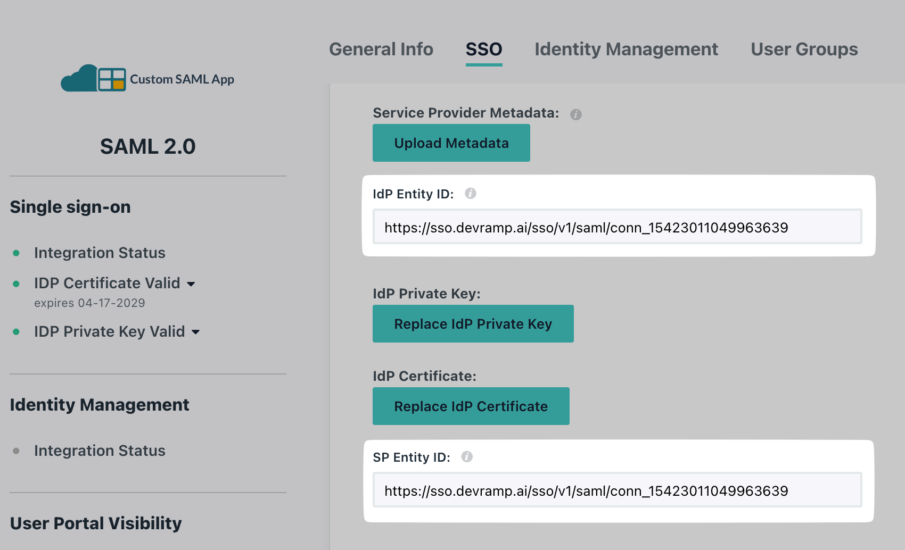
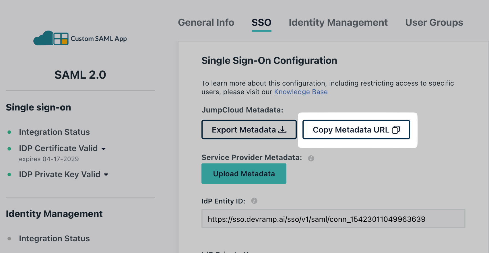

# JumpCloud SAML

<Subtitle>Step-by-step guide to configure Single Sign-on with JumpCloud as the Identity Provider. </Subtitle>

### 1. Download Metadata XML

Sign into the SSO Configuration Portal, select **JumpCloud,** then **SAML,** and click on **Configure.**

Under **Service Provider Details,** click on **Download Metadata XML**.

<figure>
<figcaption>Download Metadata XML</figcaption></figure>

### 2. Create Enterprise Application

Login to your JumpCloud Portal. Go to **SSO Applications**.

<figure>
<figcaption>Locate SSO Applications</figcaption></figure>

Click on **Add New Application.**

<figure>
<figcaption>Click on Add New Application</figcaption></figure>

In the **Create New Application Integration** search box, type **Custom SAML App**, and select it from the drop down list.

Give your app a name, select your icon (optional) and then click on **Save.**

<figure>
<figcaption>Create and save a new application integration</figcaption></figure>

Click on **Configure Application.**

<figure>
<figcaption>Click on Configure application</figcaption></figure>

### 3. SAML Configuration

Go to the **SSO** tab**.** Upload the downloaded Metadata XML (from the SSO Configuration Portal) under **Service Provider Metadata→ Upload Metadata.**

<figure>
<figcaption>Upload Metadata XML under Service Provider Metadata</figcaption></figure>

From your **SSO Configuration Portal**, copy the **SP Entity ID**. On your JumpCloud Portal paste it in the **IdP Entity ID** and the **SP Entity ID** field.

<figure>
<figcaption>Copy SP Entity ID from your SSO Configuration Portal</figcaption></figure>

<figure>
<figcaption>Paste it under IdP Entity ID and SP Entity ID on JumpCloud Portal</figcaption></figure>

- Similarly, copy the **ACS URL f**rom your SSO Configuration Portal. Go back to your JumpCloud Portal, scroll below to the **ACS URLs** section and paste it in the **Default URL** field.

<figure>
<figcaption>Copy ACS URL from SSO Configuration Portal</figcaption></figure>

<figure>
<figcaption>Paste it under Default URL on JumpCloud Portal </figcaption></figure>

### 4. Attribute Mapping

In the SSO tab, scroll to find **Attributes.**

<figure>
<figcaption>Locate Attributes section on JumpCloud Portal</figcaption></figure>

Check the **Attribute Mapping** section in the **SSO Configuration Portal**, and carefully map the same attributes on your **JumpCloud** application.

<figure>
<figcaption>Attribute mapping from SSO Configuration Portal </figcaption></figure>

<figure>
<figcaption>Attribute Mapping on JumpCloud Portal</figcaption></figure>

### 5. Assign Users

Go to the **User Groups** tab. Select appropriate users/groups you want to assign to this application, and click on **Save** once done.

<figure>
<figcaption>Assign individuals or groups to your application</figcaption></figure>

### 6. Upload IdP Metadata URL

On your JumpCloud Portal, click on **SSO.** Copy the **Copy Metadata URL**.

<figure>
<figcaption>Copy Metadata URL from your JumpCloud portal </figcaption></figure>

Under **Identify Provider Configuration,** select **Configure using Metadata URL,** and paste it under **App Federation Metadata URL** on the **SSO Configuration Portal.**

<figure>
<figcaption>Paste Metadata URL on SSO Configuration Portal</figcaption></figure>

### 7. Test Connection

Click on **Test Connection.** If everything is done correctly, you will see a **Success** response as shown below.

If the connection fails, you’ll see an error, the reason for the error, and a way to solve that error right on the screen.

<figure>
<figcaption>Test SSO configuration </figcaption></figure>

### 8. Enable Connection

Click on **Enable Connection.** This will let all your selected users login to the new application via your JumpCloud SSO.

<figure>
<figcaption>Enable SSO on JumpCloud</figcaption></figure>

With this, we are done configuring your JumpCloud application for an SSO login setup.
