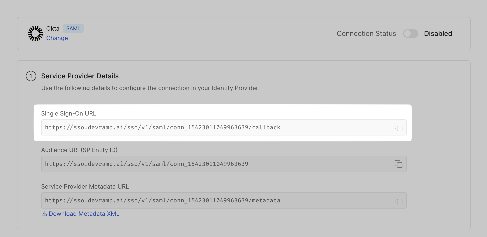
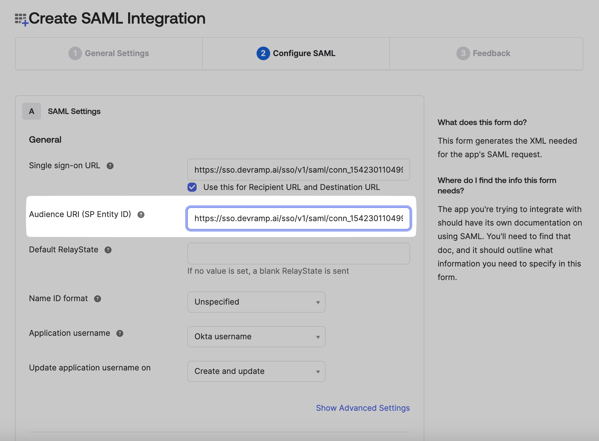
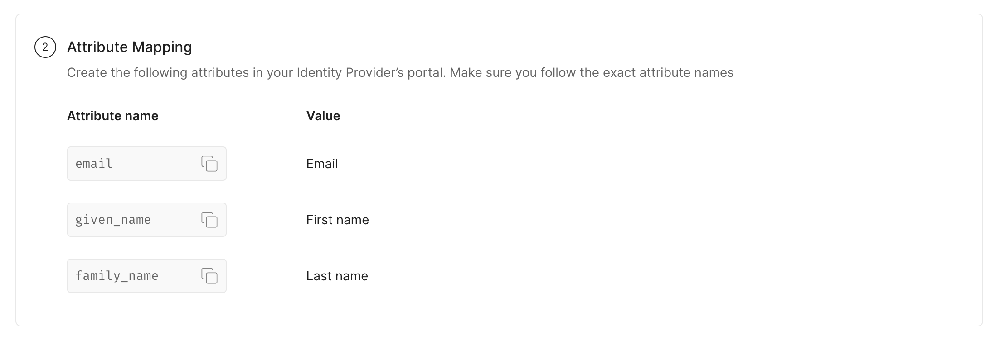

# Okta SAML

<Subtitle>Step-by-step guide to configure Single Sign-on with Okta as the Identity Provider. </Subtitle>

### 1. Create Enterprise Application

Login to your **Okta Admin Console**. Go to **Applications→ Applications.**

<figure>
<figcaption>Locate Applications</figcaption></figure>

In the **Applications** tab, click on **Create App Integration.**

<figure>
<figcaption>Click on Create App Integration</figcaption></figure>

Choose **SAML 2.0,** and click on **Next.**

<figure>
<figcaption>Select SAML 2.0 </figcaption></figure>

Give your app a name, choose your app visibility settings, and click on **Next.**

<figure>
<figcaption>General Settings for SAML integration</figcaption></figure>

### 2. SAML Configuration

Copy the **SSO URL** from the **SSO Configuration Portal**. Paste this link in the space for **SSO URL** on the **Okta Admin Console**.

<figure>
<figcaption>Copy SSO URL on Configuration Portal</figcaption></figure>

<figure>
<figcaption>Paste SSO URL on Okta Admin Console</figcaption></figure>

Similarly, copy the **Audience URI (SP Entity ID)** from the SSO Configuration Portal, and paste it in your **Okta Admin Console** in the space for **Audience URI.**

<figure>
<figcaption>Copy Audience URI on SSO Configuration Portal</figcaption></figure>

<figure>
<figcaption>Paste Audience URI on Okta Admin Console </figcaption></figure>

You can leave the Default Relay State as blank. Similarly, select your preferences for the Name ID format, Application Username, and Update application username on fields.

<figure>
<figcaption>Selecting preferences on Okta Admin Console</figcaption></figure>

### 3. Attribute Mapping

Check the **Attribute Mapping** section in the **SSO Configuration Portal**, and carefully map the same attributes on your Okta Admin Console.

<figure>
<figcaption>Attribute mapping on SSO Configuration Portal</figcaption></figure>

<figure>
<figcaption>Attribute mapping on Okta Admin Console</figcaption></figure>

### 4. Assign User/Group

Go to the **Assignments** tab.

<figure>
<figcaption>Locate Assignments tab</figcaption></figure>

Click on **Assign** on the top navigation bar, select **Assign to People/Groups.**

<figure>
<figcaption>Select Assign to People or Groups</figcaption></figure>

Click on **Assign** next to the people you want to assign it to. Click on **Save and Go Back**, and click on **Done.**

<figure>
<figcaption>Assign specific individuals or groups to app</figcaption></figure>

### 5. Finalize App

Preview your SAML Assertion generated, and click on **Next.**

<figure>
<figcaption>Preview SAML Assertion</figcaption></figure>

Fill the feedback form, and click on **Finish** once done.

<figure>
<figcaption>Feedback form after configuring SAML</figcaption></figure>

### 6. Upload IdP Metadata URL

On the **Sign On** tab copy the **Metadata URL** from the **Metadata Details** section on **Okta Admin Console.**

<figure>
<figcaption>Copy Metadata URL from Okta Admin Console</figcaption></figure>

Under **Identify Provider Configuration,** select **Configure using Metadata URL,** and paste it under **App Federation Metadata URL** on the **SSO Configuration Portal.**

<figure>
<figcaption>Paste Metadata URL on SSO Configuration Portal</figcaption></figure>

### 7. Test Connection

Click on **Test Connection.** If everything is done correctly, you will see a **Success** response as shown below.

If the connection fails, you’ll see an error, the reason for the error, and a way to solve that error right on the screen.

<figure>
<figcaption>Test SSO configuration</figcaption></figure>

### 8. Enable connection

Click on **Enable Connection.** This will let all your selected users login to the new application via your Okta SSO.

<figure>
<figcaption>Enable SSO on Okta Admin Console</figcaption></figure>

With this, we are done configuring your Okta application for an SSO login setup.
