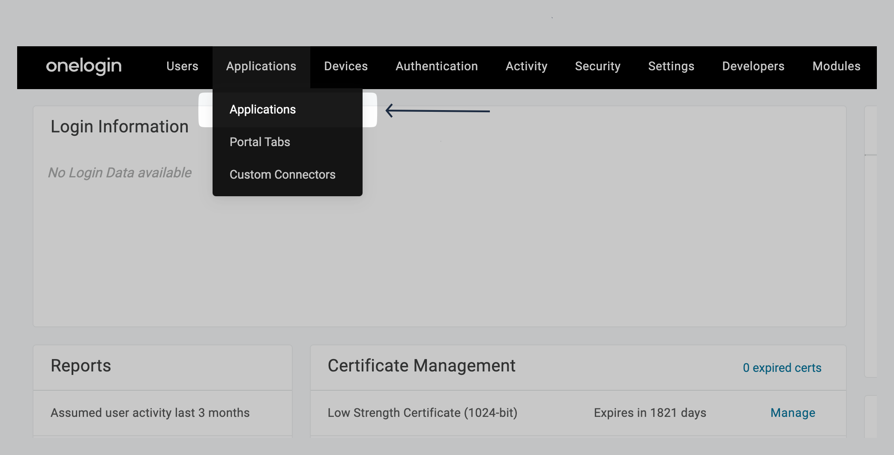
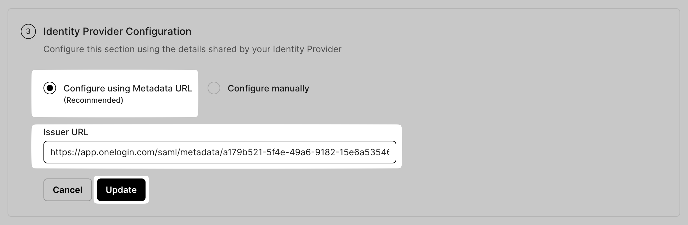

# OneLogin SAML

<Subtitle>Step-by-step guide to configure Single Sign-on with OneLogin as the Identity Provider. </Subtitle>

### 1. Creating Enterprise Application

Login to your **OneLogin Portal**. Go to **Applications→ Applications.**

<figure>
<figcaption>Locate Applications</figcaption></figure>

Click on **Add App.**

<figure>
<figcaption>Click on Add App</figcaption></figure>

In the **Find Application** search box, type in **SAML Custom Connector (Advanced)**, and select it from the drop down list.

<figure>
<figcaption>Select SAML Custom Connector from drop down (GIF)</figcaption></figure>

Give your app a name that reflects the application you'll be connecting it to, so users can easily recognize it in their OneLogin portal., select your icon (optional) and then click on **Save.**

<figure>
<figcaption>Click on Save</figcaption></figure>

### 2. SAML Configuration

On the Application page click on **Configuration.**

<figure>
<figcaption>Locate Configuration </figcaption></figure>

From your **SSO Configuration Portal**, copy the **ACS (Consumer) URL**. Go back to your **OneLogin Admin Portal**, and paste it in the **Recipient** and **ACS (Consumer) URL Validator** fields.

<figure>
<figcaption>Copy ACS (Consumer) URL on SSO Configuration Portal </figcaption></figure>

**OneLogin Admin Portal**

<figure>
<figcaption>Paste it in Recipient, ACS URL Validator, and ACS(Consumer) URL fields on OneLogin Admin Portal</figcaption></figure>

Similarly, copy the **Audience (Entity ID) f**rom your SSO Configuration Portal. Go back to your **OneLogin Admin Portal**, and paste it in the **Audience (EntityID).**

<figure>
<figcaption>Copy Audience (Entity ID) on SSO Configuration Portal</figcaption></figure>

<figure>
<figcaption>Paste copied URL in Audience (EntityID) on OneLogin Admin Portal</figcaption></figure>

Click on **Save**.

<figure>
<figcaption>Locate Save</figcaption></figure>

### 3. Attribute Mapping

Go to the **Parameters** tab on **OneLogin Admin Portal**, and click on the plus (+) sign to add attributes.

<figure>
<figcaption>Locate Parameters tab </figcaption></figure>

Check the **Attribute Mapping** section in the **SSO Configuration Portal**, and carefully map the **exact** **same attributes** on your **OneLogin Admin Portal**.

<figure>
<figcaption>Check attributes on SSO Configuration Portal </figcaption></figure>

<figure>
<figcaption>Paste attributes on OneLogin Admin Portal</figcaption></figure>

### 4. Assign User/Group

Go to the **Users** tab.

<figure>
<figcaption>Locate Users under Users tab</figcaption></figure>

Click the user you want to assign to the application.

<figure>
<figcaption>Select user to assign</figcaption></figure>

Click on the **Applications** tab. Click on the **+** sign to assign the newly created application.

<figure>
<figcaption>Add application to previously selected user</figcaption></figure>

Select the newly created application from the drop down, and click on **Continue.**

<figure>
<figcaption>Select application from drop-down</figcaption></figure>

Click on **Save**.

<figure>
<figcaption>Save user assignment to application</figcaption></figure>

### 5. Upload IdP Metadata URL

On **OneLogin Admin Portal**, click on SSO. Copy the **Issuer URL**.

<figure>
<figcaption>Copy Issuer URL on OneLogin Admin Portal</figcaption></figure>

Under **Identify Provider Configuration,** select **Configure using Metadata URL,** and paste it under **App Federation Metadata URL** on the **SSO Configuration Portal.**

<figure>
<figcaption>Paste Issuer URL on SSO Configuration Portal </figcaption></figure>

### 6. Test Connection

Click on **Test Connection.** If everything is done correctly, you will see a **Success** response as shown below.

If the connection fails, you’ll see an error, the reason for the error, and a way to solve that error right on the screen.

<figure>
<figcaption>Test SSO Configuration</figcaption></figure>

### 7. Enable Connection

Click on **Enable Connection.** This will let all your selected users login to the new application via your **OneLogin Admin Portal** SSO.

<figure>
<figcaption>Enable SSO on Onelogin Admin Console</figcaption></figure>

With this, we are done configuring your **OneLogin Admin Portal** application for an SSO login setup.
