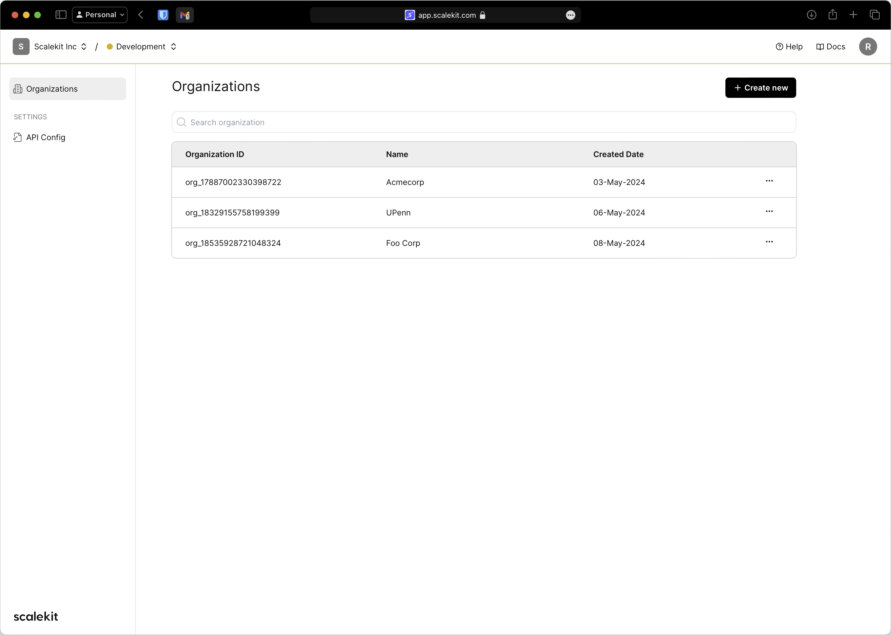
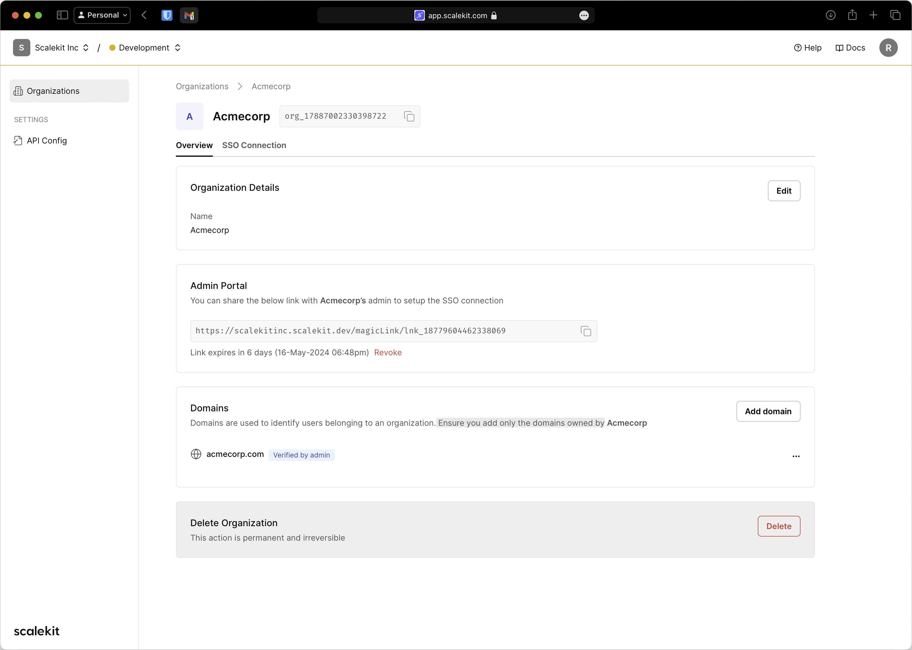
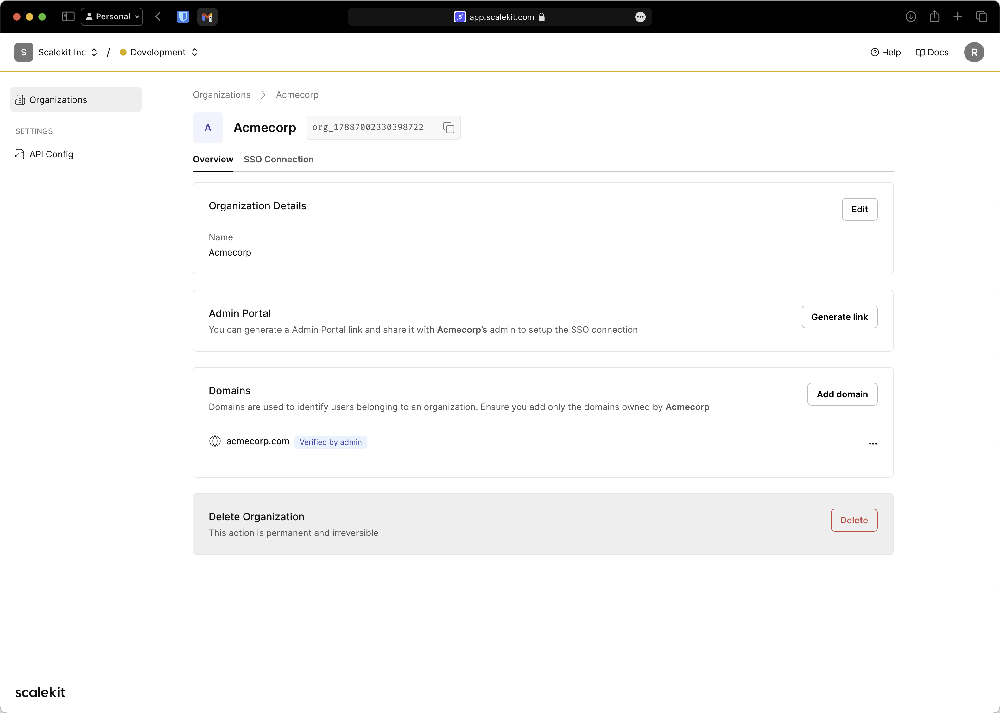

# Organizations

## Overview
Organizations represent your customers (or accounts) in your application. Your application’s users would belong to these Organizations. For each of your customer who needs to use Single Sign-on (SSO) to login to your application, you need to create an Organization in Scalekit Dashboard and configure their SSO settings in that Organization.

Navigate to the **Organizations** section in your Scalekit Dashboard to view all Organizations that are configured for your application. Reference screenshot shown below:

<figure>
<figcaption>List of Organizations</figcaption></figure>

## Create Organization
You can create a new Organization by clicking on the **Create new** button. Enter the name of the organization and click **Add**.

<figure>
<figcaption>Create Organization</figcaption></figure>

After the organization is successfully created, you are redirected to the newly created Organization's Overview tab. From here, you can perform multiple actions in this new Organization such as Enable Single Sign-on, Generate Admin Portal link, configure Home Realm Discovery etc

## Generate Admin Portal Link
Admin Portal is a configuration portal that enables your customers' IT admins to configure Single Sign-on on their own. Designed to streamline the SSO config process, Admin Portal reduces the demand on your engineering resources and eliminates back-n-forth customer support issues. Fully hosted and managed by Scalekit, Admin Portal ensures a fast and secure integration with only a few lines of code.

In the **Admin Portal** section, click 'Generate Link' to create a new shareable Admin Portal link. Copy this link and share it with your customer's admin team to let them enable Single Sign-on between your application and their Identity Provider. Please note that the Admin Portal link has an expiry timestamp and can be revoked at any time for security reasons. Screenshot below shows the generated Admin Portal link.

<figure>
<figcaption>Organization - Generate Admin Portal link</figcaption></figure>

## Enable Home Realm Discovery
**Home Realm Discovery HRD)** is the algorithm that allows Scalekit to identify which Identity Provider (IdP) the user belongs to before authenticating them. At the time of login, Scalekit determines the Organization (the Realm) through the user’s email subdomain and thus initiates the SSO connection through that respective IdP. 

Example: if an Organization, Foo Corp, uses Okta as the IdP and if a user tries to login using her email, jane@foocorp.com, Scalekit would initiate the SSO through Foo Corp's Okta. 

To enable seamless SSO experience for your users, we recommend to configure domains that need to be mapped to an Organization. Add all relevant domains in the **Domains** section. Reference screenshot below where acmecorp.com is added as verified domain.

:::info
Ensure you add only the domains that you know are owned by this Organization. 

Coming Soon: Self-service DNS based domain verification for the Organizations.
:::

<figure>
<figcaption>Organization - Domain configuration</figcaption></figure>
