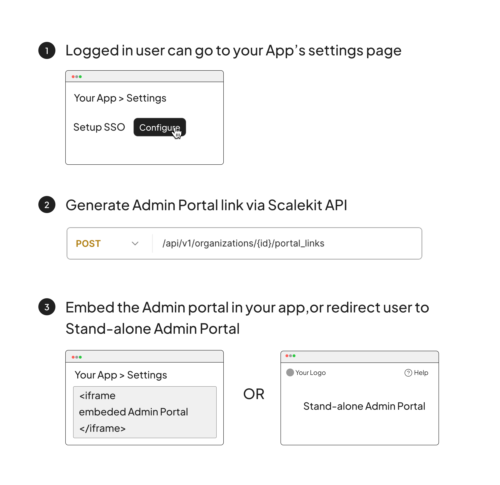

import InstallSDK from './../templates/install-sdk.md';

# Admin Portal

<Subtitle>Fully managed self-service SSO for your customers</Subtitle>

## Overview

The Admin Portal is a self-service interface designed to empower IT admins to configure SSO independently, thereby reducing the demand on engineering resources. Fully hosted and managed by Scalekit, it simplifies the SSO setup process with comprehensive IdP-specific documentation, ensuring a fast and secure integration with just a few lines of code.

<!--
<figure>
<figcaption>Two ways of integrating Admin Portal</figcaption></figure> -->

## 1. Via API

<figure className='width-50'></figure>

### Configure SDK

Begin by installing the Scalekit SDK, which provides necessary tools for creating a secure and efficient connection to the Admin Portal.

<InstallSDK />

### Generate Magic Link

Use the [generatePortalLink](/api-reference#tag/customer-portal/put/api/v1/organizations/{id}/portal_links) API to generate an Admin Portal link that is uniquely keyed to an organization. You can either embed this as an iframe in your application or redirect the user to this link for the admin to self serve configure SSO for their organization.

<Tabs groupId="tech-stack">
<TabItem value="nodejs" label="Node.js">

```javascript showLineNumbers
// generate admin portal link by sending organization id as a parameter
const link = await sc.organization.generatePortalLink('org_1233222');

// link.location is the Admin Portal url
```

 </TabItem>
<!--<TabItem value="py" label="Python">

```python
# write python code here
```

</TabItem>
<TabItem value="golang" label="Go">

```go
// write go code here
```

</TabItem> -->
</Tabs>

Note:

- This link is designed for one-time use, expiring after 5 minutes or upon its initial access.
- Once activated, the IT admin can configure SSO for a longer period of time. The session will remain active until the setup is complete.
- Depending on your UX strategy, you may choose to redirect the IT admin to this link or embed it within your application as an iframe, allowing configuration without navigating away from your product.

## 2. Via Shareable Link

<figure className='width-50'></figure>

Log in to your Scalekit Dashboard and navigate to the desired organization's overview section.

### Generate Link

<!-- <Show screenshot> -->

Click 'Generate Link' to create a new, shareable Admin Portal link.

- This link is valid for 7 days but can be revoked at any time from the dashboard for security purposes.
- The link can be distributed through communication channels such as email, Slack, etc
- Exercise caution, as anyone with this link can view and update their organization's SSO settings
